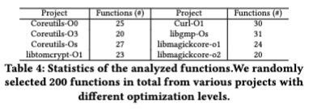
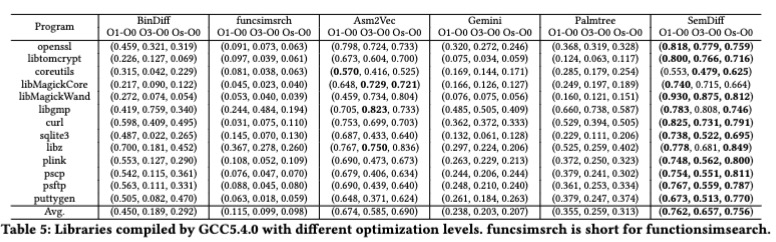
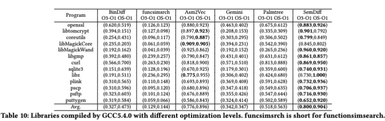

### Binary Code Similarity Detection Tool -- SemDiff
SemDiff contains two modules, graph generation and graph diffing

### Graph Generation
This module include all the symbolic_engine folder, compare_sim/write_IR.py, and compare_sim/IR_graph/check_IRs_similarity.py.

### Graph Diffing 
This module is in compare_sim/IR_graph/check_IRs_similarity.py.

### Data
This folder contains the data we used for experiments. This include cross-compiling-optimization-level, cross-compilers, corss-versions, and cross-ollvm-flags. The specific data are: openssl-3.3.0, libtomcrypt-1.18.2,
coreutils-8.32, ImageMagick-7.1.010, libgmp-6.2.1, curl-7.80, sqlite3-3.37.0, zlib-1.2.11
and Puttygen-0.74. 

In particular, Coreutils is compiled into about 150 binaries by default and we modify its build configuration to merge them into a single binary. 
LibMagickCore and libMagickWand are from the Imagemagick project, while plink, pscp, psftp, and puttygen are from the Puttygen project. For libtomcrypt, we can compiled it into a a shared library. 
 
### Installation

First of all, this is a plugin for IDA pro. Make sure you install IDA pro first. We implemented on IDA pro 7.5 SP3 in Windows. Thus this plugin works for this version.
We haven't tested on other versions of IDA pro.

open up the binary_similarity.cpp file, change "working_path" to the path you want to generate symbolic expression files at.

Then open up idasdkandtools_ida7.5hello.sln, build it. Once successful, you will find semdiff64.dll for IDA pro 64 under symbolic_engine\x64\Debug. By default we 
implement for IDA pro 64. If you want to build for IDA pro 32, you can select x64/x86 under Configuration Manager in Visual Studio.

To install the dll plugin into IDA pro, copy paste semdiff64.dll under plugins folder in IDA pro 7.5. 

You also need to install msynth and miasm for python.

### Usage

##### Graph Generation

1. Once open IDA pro and load the binary, under plugin you can find the "binary similarity detection" or press F8. Click this button, then current binary's symbolic
files will be generated under the path you changed for "working_path". A folder with the name same as the binary loaded will be generated in the "working_path". Within the folder is a list of folders which are named by each functions in the binary. For each function, we output a 0_output.txt file recording the symbolic expressions and a IR_output.txt file recording the control flow. 

2. Since the 0_output.txt contains the symbolic formula that can be very complex, to simplify it, run: ``` python compare_sim/write_IR.py ```
This generates a IR_output1.txt and a IR_output1_simplified.pickle for each function, which represent the symplified key instructions.


##### Graph Diffing
3. Run ```python compare_sim/IR_graph/check_IRs_similarity.py``` and input two binaries you want to check similarity against each other. This will output a sim.txt file under each function folder. 
Then extract functions with at least 5 blocks (If you have Asm2vec, you can extract the same functions as Asm2vec through copy_same_files function in compare_sim/check_output/).

4. Lastly, check precision@1 score by running main function in compare_sim/check_output/ .
 
 
### Experiment Results
Due to the paper page limitation, we show the complete experiment results here. 
Our dataset for experiment include openssl-3.3.0, libtomcrypt-1.18.2,
coreutils-8.32, ImageMagick-7.1.010, libgmp-6.2.1, curl-7.80, sqlite3-
3.37.0, zlib-1.2.11 and Puttygen-0.7.

We selected pairs that have high NCD scores for experiment. The calculation for an NCD score is as follows: $$NCD(x,y)=\dfrac{C(x\cdot y)-min(C(x),C(y))}{max(C(x),C(y))},$$
where $C(x)$ returns the compressed length of a binary $x$ in the unit of raw bytes. $x\cdot y$ denotes the concatenation of two binaries.
%the ground truth difference. 
An NCD score is between 0.0 and 1.0, and a higher score for two binaries indicates that they are more dissimilar to each other. 

#### Experiment 1: Correctness of Key Expressions


To justify the correctness of the translated key expressions, we
randomly selected 200 functions from the dataset and manually 
analyzed them. The figure records our analyzed data. For each function, we read
each assembly instruction line and check the correctness of their
symbolic expressions in order to check the correctness of the key
expressions. The result shows that 85% of the key expressions are
correct. For the failure causes, please refer to our paper.

<!--Result Analysis: The incorrectness were due to two aspects: 1) the lack of
support of some x64 mnemonics’ variants. For example, mov and
movzx both move the value into a register or a memory address
where the former mnemonic directly moves the value while the
latter one further zero extend the value if the value has less bits
than the register or the memory address. Since mnemonics like
movzx are rarely observed in the projects, we did not support them
in the current version of SemDiff. Rather, we address movzx as mov,
which can cause subtle inaccuracy in the symbolic expression. 2)
Sometimes the IDA pro that SemDiff depends on can mistakenly
resolve strings. We designed SemDiff to resolve strings variables
names into the contents of the string. For example, SemDiff resolves
string variable address from instruction mov esi, address into
“Rtmin” that address points to. However, in some cases, IDA pro
may consider constant value as memory address and resolve the
content at that memory address.-->

#### Experiment 2: Similarity Quantification Cross Compiling Optimization, Compilers, and Obfuscations
##### Experiment 2.1: Similarity Quantification in Cross-GCC-Compiling-Optimization-Level



In this experiment, we compile the same dataset with the same compiler (GCC) 
with different optimizaiton levels (O0,O1,O3,Os). And we select different 
pairs for similarity comparison. For example, GCC O1 vs. O0 means we compare 
the two binaries, one compiled using O1 and another compiled using O0.
The figures shows the similarity score we abtain by using different tools.
In all the pairs of GCC optimization levels, SemDiff outperforms
all other tools on average. SemDiff has the highest scores generally. 
For the programs where SemDiff performs less well,
Asm2vec has the highest precision@1 score while SemDiff ranks
some ground-truth functions at positions from 2 to 10, indicating
that SemDiff rates these functions across optimization levels to
high similarity.

##### Experiment 2.2: Similarity Quantification in Cross-Compiler.


In this experiment, we compile the same dataset with the different compilers (CLANG and GCC)
with same optimizaiton levels (O0,O1,O3,Os). And we select different 
pairs for similarity comparison. For example, CLANG O1 vs. GCC O0 means we compare 
the two binaries, one compiled using CLANG O1 and another compiled using GCC O0. 
The results in Table 6 show that SemDiff achieves
the best detection performance on average. For the cases where
SemDiff performs less well, Asm2vec achieves the best precision@1
score even though SemDiff has close results. On average, SemDiff
outperforms all other tools in the 5 pairs of CLANG and GCC
optimization levels. For more detailed result analysis please refer to our paper.

<!--For binaries compiled from the same source code using different
optimization levels in Section 5.2.1 or different compilers in Sec-
tion 5.2.2, their function numbers vary significantly mainly due to
the inline functions. Also, they are likely to differ in almost all 
the assembly functions as some instructions inside a function have
syntactic differences but the same semantics. These differences
will result in different function attributes such as the statistics of
basic blocks, instructions and mnemonics. Thus methods relies on
syntactic information (all except SemDiff) are less accurate. How-
ever, most key semantics of a function is still preserved in this case,
making SemDiff more effective than other tools.

Result Analysis: For the experiments in Section 5.2 and Section 5.2.2, we suspect
SemDiff can abstract higher level of semantic information into key
expression from the plain assembly instruction and the LSH hashing
can effectively compare the two key-semantic graphs with both
topological and semantic information. Therefore SemDiff achieves
the best results. In comparison, all other tools directly take the
assembly code as the input, which can contain more noise with
obscure semantic information thus decreases the results.

To understand the root cause of the failure cases of SemDiff, we
manually analyzed the results and found that in experiments Sec-
tion 5.2 and Section 5.2.2, when SemDiff failed to rank the ground
truth similar function at the first place, in approximately 50% of
the cases, SemDiff still rank the similar function before 10th place.
We consider this still can assistant find similar functions efficiently,
with some extra minor manual analysis. In the other 50% cases,
SemDiff failed to rank similar function at front positions mainly
due to three reasons: 1) Lack of support for some less frequent
mnemonics such as cvtss2sd. This can negatively impact the se-
mantic information extraction thus decrease accuracy. 2) Some calls
are optimized into other instructions. For example, call strlen
be replaced to repne scasb, which has the same impact and output
with call strlen. Even using symbolic execution, their symbolic
values still differs enormously. 3) Sometimes, the unfolded loop and
the folded loop can be difficult to match. Because their symbolic
expressions can differ. And the number does not match (i.e., un-
folded loop only exists once while unfolded loop can exists more
than once).-->

##### Experiment 2.3: Similarity Quantification in Different Obfuscation Options


For each program, we generate three pairs and each pair consists
of a CLANG-compiled binary and an OLLVM-compiled binary with
one obfuscation option. We then fed each pair into SemDiff and
two representative machine-learning-based tools (i.e., Gemini and
Palmtree) for similarity quantification. The results are shown in
Table 8. Clearly, SemDiff outperforms the other two tools for all
obfuscation options with large margin. For more detailed result analysis please refer to our paper.

<!--Result Analysis: In this ecperiment, we speculate that although
the obfuscation options obfuscate a binary in terms of its syntactic
structures, they retain its key semantics, which can be retrieved
by SemDiff For the three evaluated tools, their generated scores
under the SUB option achieve the highest compared to the other
options. This is probably because the SUB option does not change
the control flow. Of the three options, scores in the FLA option
are the lowest, as it introduces more syntactical and control-flow
changes by flattening the control flow. The failure causes remains
the same as previously discussed.-->

#### Experiment 3: Applications of SemDiff

##### Experiment 3.1: Similarity Quantification in Cross-Program-Version


In this experiment, we compile the project from different versions,
with the same optimization level and compiler (GCC). For example, 
1.0.2o vs. 3.0.0 means we compare similarity of two binaries. 
One is compiled using version 1.0.2o, and another compiled using 
version 3.0.0.
Particularly, SemDiff achieves the best detection performance
in 10 programs and ranks second in the remaining 3 programs,
i.e., coreutils, libgmp, and sqlite3. For both coreutils and sqlite3,
SemDiff’s averaged score is only 0.01 lower than that of Bindiff. For
libgmp, SemDiff’s score is only 0.03 lower than that of Asm2vec. A
possible reason why SemDiff performs less well in the 3 programs
is: as the version difference in the 3 programs is smaller than that
of the 10 programs, it indicates that the versions in these programs
have more similarities in syntactic structures, which are easier to
be captured by tools that rely on syntactic and structural features.
When the version difference becomes larger in other programs,
SemDiff performs the best. For more detailed result analysis please refer to our paper.

<!--Result Analysis: We note that all the 6 tools achieve higher scores compared to
experiments in Section 5.2.1 and Section 5.2.2, which can be attrib-
uted to two possible reasons. First, most functions in a program
of different versions can be the same, and only a small number
of functions are different. Second, for a function that is updated
in different versions, most of its function code remains the same
and thus cross-program-version has more syntactic and structural
similarities than previous cross-compiling-optimization-level and
cross-compiler. The reasons for the failure cases in this experiment
are also mainly due to lack of support for rare mnemonics, replacing
calls to equivalent instructions, and difficulty to precisely match
loops.-->

##### Experiment 3.2: Vulnerability Search


We randomly selected 18 Common Vulnerabilities and Exposures
(CVEs) functions and detect their similar vulnerable functions. For
each vulnerable function, we randomly select a vulnerable version
of it as the reference that the tool tries to find similar functions to.
We also prepare another randomly selected vulnerable version of
the function that compiled with random compiling settings (i.e.,
either O0, O1, O2, O3, Os) as the target function that the tools should
detect them as similar to the reference function. Since usually the
vulnerable function is absent in the project’s main binary (e.g., curl)
and resides in the .o file (e.g., libcurl_la-mprintf.o) that contains
only a few other functions in total, we mix all the functions in that
.o file together with all the functions in the project’s main binary.
We check the probability of the tool successfully ranking the target
vulnerable function at the first place in the mixed functions (i.e.,
top-1 score). The result is shown in Table 9. Asm2vec’s top-1 score
is 9 out of 18 (50%) while SemDiff is 10 out of 18 (55.6%). For more detailed result analysis please refer to our paper.

<!--Result Analysis: We manually analyzed the CVEs where SemDiff fails to identify
(rank at the first place). We found that out of 8 failure cases, in 6
cases (75%) SemDiff ranked the vulnerable function before 10th
place. This still indicates the effectiveness of using SemDiff to find
vulnerabilities. For the other 2 failure cases, one is due to IDA pro
failed to identify the indirect jump addresses thus made SemDiff
ineffective. Another was due to lack of support for less frequent
mnemonics, which negatively impact the semantic information
extraction thus decreased the accuracy.-->

<!--
**SemDiff4BinaryDetection/SemDiff4BinaryDetection** is a ✨ _special_ ✨ repository because its `README.md` (this file) appears on your GitHub profile.

Here are some ideas to get you started:

- 🔭 I’m currently working on ...
- 🌱 I’m currently learning ...
- 👯 I’m looking to collaborate on ...
- 🤔 I’m looking for help with ...
- 💬 Ask me about ...
- 📫 How to reach me: ...
- 😄 Pronouns: ...
- ⚡ Fun fact: ...
-->
